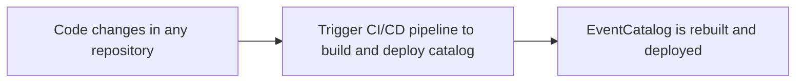

import AddedIn from '@site/src/components/MDX/AddedIn';

Many people are deploying EventCatalog in different ways, as it's self hosted you can rebuild and redeploy your catalog as often as you want.

### Keeping EventCatalog up to date

Keeping documentation up to date is a challenge, as it's easy to forget to update the documentation when you make changes to your code.

One way to keep your documentation up to date, is to redeploy your catalog whenever changes are made to your code, specifications or schemas.

EventCatalog has companies redeploying their catalogs hundreds of times a day.... it really depends on how often you make changes to your code, specifications or schemas, and how often you want to update your documentation. **You are in control of how often you redeploy your catalog.**

Many folks using EventCatalog have information scattered across multiple repositories, schema registries and other systems.

Users of EventCatalog either use [our integrations (e.g AsyncAPI, OpenAPI, Schema Registry)](/integrations) or have built their own automated systems using our [SDK](/docs/sdk).

### CI/CD workflow to keep your documentation up to date

EventCatalog is docs-as-code solution. This means you can store EventCatalog next to your code and in git repositories.

You can setup your CI/CD pipeline to build and deploy your catalog whenever changes are made to your code, specifications or schemas.

EventCatalog is flexible. And you can redeploy your catalog in various ways.

This can let you setup automation to ensure your documentation can stay up to date with any changes to your code, specifications or schemas.

