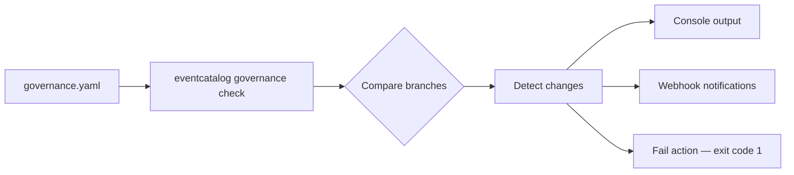

import EventCatalogPro from '@site/src/components/MDX/EventCatalogPro';

<EventCatalogPro />

Services get added. Consumers change. Producers disappear. In event-driven systems, these relationship changes often go unnoticed until something breaks downstream.

**Architecture Change Detection** compares your catalog across branches and tells you exactly what changed: which services started consuming a message, which stopped producing one, and who is affected.

You can configure webhooks to send notifications to tools like Slack or PagerDuty when changes are detected, including relationship changes, deprecations, and schema updates. Rules can also be configured to block CI/CD pipelines entirely using the `fail` action.

:::info Scale plan required
Architecture Change Detection requires an [EventCatalog Scale plan](https://eventcatalog.dev/pricing).
:::

## How it works

1. Define rules in `governance.yaml` at the root of your catalog
2. Each rule specifies **triggers** (what kind of change to detect), **resources** (which services or messages to watch), and **actions** (how to get notified)
3. Run `eventcatalog governance check` to compare your catalog against a base branch
4. Matched changes print to the console, fire webhook notifications, and optionally exit with a non-zero code to block merges



## Quick example

```yaml title="governance.yaml"
rules:
  - name: notify-consumer-changes
    when:
      - consumer_added
      - consumer_removed
    resources:
      - "*"
    actions:
      - type: console
      - type: webhook
        url: $SLACK_WEBHOOK_URL
```

This rule detects whenever any service starts or stops consuming any message, and sends a notification to Slack.

## Notifications when you want them

Using the [`status` field](/docs/development/governance/architecture-change-detection/ci-cd#include-a-status-label) you can choose to detect changes that are proposed vs approved. This can be useful when you want to detect changes that are proposed vs approved in your architecture.


