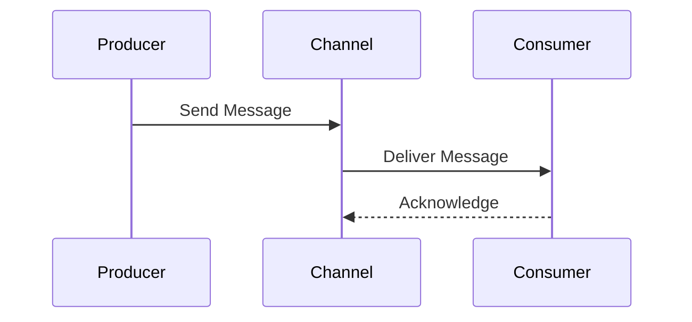

import AddedIn from '@site/src/components/MDX/AddedIn';

<AddedIn version="2.13.0" />

In EventCatalog a channel represents the organization and transmission of messages. 

Channels in EventCatalog describe how a messages transport between producers and consumers. You can use the channels resource to help your team understand how your messages are transported.

 

Channels are resources in EventCatalog that you can define in a `/channels` directory. 
The channel directory can be defined anywhere in your EventCatalog or you can have many channel directories in your EventCatalog.

<!-- Any message ([event](/docs/development/guides/messages/events/introduction), [command](/docs/development/guides/messages/commands/introduction) or [query](/docs/development/guides/messages/queries/introduction)) can be associated to one or many channels. -->

### Example of a channels are visualized in EventCatalog

Here is an example of the `Orders Service` publishing an event `Order amended` over a `Kafka` channel.

<!-- <a class="block" href="https://demo.eventcatalog.dev/visualiser/services/InventoryService/0.0.2">View demo</a> -->

### Routing messages through multiple channels

<AddedIn version="2.55.0" />

In some cases you may want to model how messages are routed through multiple channels, you can do this using channel `routes`.

In the example below:

    - The Payment Service publishes a `PaymentProcessed` event over the `PaymentEvents` channel.
    - The Billing Service subscribes to the `PaymentProcessed` event through the `PaymentEvents` channel.
    - The Fraud Detection Service subscribes to the `PaymentProcessed` event through the `Fraud Dection Queue` which is pulling from the `PaymentEvents` channel (chained channels)

:::info What is the `PaymentEvents` channel?
This is just an example, but a channel can be any protocol you like. For example if you are using Kafka then this channel could be a Kafka topic.
Or if you are using an Event Bus this channel could be your bus, queue or topic.

You can model as many channels as you like, and you can route messages through multiple channels.
:::

### Supported Channel Protocols

**EventCatalog is technology agnostic**, so can work with any protocol.

Using channels you can define the `protocol` used, this can be one or many protocols.

Here is a list of protocols that are supported by EventCatalog (with icons)

- [amqp](https://en.wikipedia.org/wiki/Advanced_Message_Queuing_Protocol#:~:text=The%20Advanced%20Message%20Queuing%20Protocol,protocol%20for%20message%2Doriented%20middleware.)
- [azure-event-hubs](https://learn.microsoft.com/en-us/azure/event-hubs/event-hubs-about)
    - _Added in EventCatalog 2.37.4_
- [azure-service-bus](https://learn.microsoft.com/en-us/azure/service-bus-messaging/service-bus-messaging-overview)
    - _Added in EventCatalog 2.37.4_
- [azure-eventgrid](https://learn.microsoft.com/en-us/azure/event-grid/overview)
    - _Added in EventCatalog 2.37.4_
- [eventbridge](https://aws.amazon.com/eventbridge/)
- [googlepubsub](https://cloud.google.com/pubsub)
- [grpc](https://grpc.io/)
- [http](https://en.wikipedia.org/wiki/HTTP)
- [jms](https://www.oracle.com/java/technologies/java-message-service.html)
- [kafka](https://kafka.apache.org/protocol.html)
- [kinesis](https://aws.amazon.com/kinesis/)
- [mercure](https://mercure.rocks/)
- [mqtt](https://en.wikipedia.org/wiki/MQTT)
- [nats](https://docs.nats.io/reference/reference-protocols/nats-protocol)
- [pulsar](https://pulsar.apache.org/docs/next/developing-binary-protocol/)
- [redis](https://redis-doc-test.readthedocs.io/en/latest/topics/protocol/)
- [sns](https://aws.amazon.com/sns/)
- [solace](https://solace.com/products/apis-protocols/)
- [sqs](https://aws.amazon.com/sqs/)
- [tibco-ftl](https://www.tibco.com/products/tibco-ftl)
    - _Added in EventCatalog 2.37.4_
- [tibco-rv](https://docs.tibco.com/products/tibco-rendezvous)
    - _Added in EventCatalog 2.37.4_
- [ws](https://developer.mozilla.org/en-US/docs/Web/API/WebSockets_API)
- [webrtc](https://webrtc.org/)
    - _Added in EventCatalog 2.55.1_
- [zmq](https://zeromq.org/)

If you are using a protocol that is not on this list, please raise on issue on [GitHub](https://github.com/event-catalog/eventcatalog) so we can get the icon supported.

<!-- 
### Further reading
- [Event-driven architecture and domain-driven design](https://eda-visuals.boyney.io/visuals/eda-and-ddd)
- [Domain, Subdomain, Bounded Context: Problem/Solution Space in DDD: Clearly Defined](https://medium.com/nick-tune-tech-strategy-blog/domains-subdomain-problem-solution-space-in-ddd-clearly-defined-e0b49c7b586c)
- [Building Blocks of DDD](https://redis.io/glossary/domain-driven-design-ddd/) -->