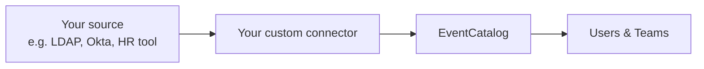

import AddedIn from '@site/src/components/MDX/AddedIn';
import PlanBanner from '@site/src/components/MDX/PlanBanner';

<PlanBanner plan="Scale" />
<AddedIn version="3.44.0" pkg="@eventcatalog/connectors" />

Connectors are how EventCatalog imports and syncs users and teams from an external source so you can assign them as owners on resources in your catalog. EventCatalog ships with built-in connectors (such as [Sync from GitHub](/docs/development/guides/owners/sync-from-github) and [Sync from Microsoft Entra ID](/docs/development/guides/owners/sync-from-microsoft-entra)), but if your team uses a different system &mdash; an internal HR tool, an LDAP directory, a SaaS like Okta, or anything else &mdash; you can write your own connector with a small amount of custom code.

A custom connector is a JavaScript function you define that returns a list of users and teams. EventCatalog runs it on startup and treats the results the same as any other connector. You build it using `defineDirectorySource` from `@eventcatalog/connectors` and register it in the same `directory.sources` array used by the built-in connectors.



## Build a connector

A connector is an object with a `type`, a `name`, and at least one of `loadUsers` or `loadTeams`:

```js title="connectors/company-directory.js"
import { defineDirectorySource } from '@eventcatalog/connectors';

export const companyDirectory = defineDirectorySource({
  type: 'directory',
  name: 'company-directory',

  async loadTeams() {
    // Call your external API here (e.g. LDAP, Okta, your HR system)
    // and return the teams in the shape below.
    return [
      {
        id: 'platform',
        name: 'Platform',
        summary: 'Platform engineering team.',
        members: ['alice'],
        source: {
          provider: 'company-directory',
        },
      },
    ];
  },

  async loadUsers() {
    // Call your external API here to fetch users
    // and return them in the shape below.
    return [
      {
        id: 'alice',
        name: 'Alice',
        avatarUrl: 'https://example.com/alice.png',
        source: {
          provider: 'company-directory',
        },
      },
    ];
  },
});
```

Register it in `eventcatalog.config.js`:

```js title="eventcatalog.config.js"
import { companyDirectory } from './connectors/company-directory.js';

export default {
  // ... rest of config
  directory: {
    sources: [companyDirectory],
  },
};
```

## User shape

| Field | Type | Required | Description |
|---|---|---|---|
| `id` | `string` | Yes | Unique identifier. Matches the `id` used to reference the user as an owner. |
| `name` | `string` | Yes | Display name. |
| `avatarUrl` | `string` | No | URL to a profile image. |
| `role` | `string` | No | Job title or role description. |
| `email` | `string` | No | Contact email address. |
| `markdown` | `string` | No | Markdown body rendered on the user's page. |
| `source` | `object` | No | Provider metadata. The `provider` field is used for the source badge in the UI. |

## Team shape

| Field | Type | Required | Description |
|---|---|---|---|
| `id` | `string` | Yes | Unique identifier. Matches the `id` used to reference the team as an owner. |
| `name` | `string` | Yes | Display name. |
| `summary` | `string` | No | Short description. |
| `members` | `string[]` | No | List of user `id` values who belong to the team. |
| `email` | `string` | No | Contact email address. |
| `markdown` | `string` | No | Markdown body rendered on the team's page. |
| `source` | `object` | No | Provider metadata. The `provider` field is used for the source badge in the UI. |
