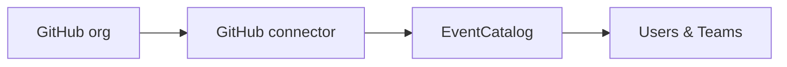

import AddedIn from '@site/src/components/MDX/AddedIn';
import PlanBanner from '@site/src/components/MDX/PlanBanner';

<PlanBanner plan="Scale" />

In EventCatalog, you can import and sync your users and teams directly from GitHub. Instead of adding people and teams by hand, you point EventCatalog at your GitHub organization and the catalog stays in sync with it automatically. Once synced, your GitHub teams and users can be assigned as owners on any resource in the catalog (services, events, domains, and more).



## Why sync from GitHub

Teams and users in EventCatalog are used to assign ownership to resources such as services, events, and domains. Keeping that ownership data accurate requires the user and team lists to reflect who actually works on each system. Syncing from GitHub automates that by pulling the data from an org you already manage.

## How it works

When EventCatalog starts, the connector fetches users and teams from GitHub. They appear in the catalog alongside any users and teams you have defined locally, and each synced entry is marked as read-only with a link back to the source record on GitHub.

## Install

```bash
npm install @eventcatalog/connectors
```

## Configure

Import `githubDirectory` and add it to the `directory.sources` array in `eventcatalog.config.js`:

```js title="eventcatalog.config.js"
import { githubDirectory } from '@eventcatalog/connectors';

export default {
  // ... rest of config
  directory: {
    sources: [
      githubDirectory({
        org: 'your-org',
        token: process.env.GITHUB_TOKEN,
        teams: ['platform', 'architecture'],
        users: true,
      }),
    ],
  },
};
```

## Options

| Option | Type | Required | Description |
|---|---|---|---|
| `org` | `string` | Yes | GitHub organization slug. |
| `teams` | `string[]` | Yes | One or more team slugs to sync. At least one is required. |
| `token` | `string` | No | Personal access token or GitHub App installation token. Required for private organizations and to avoid rate limits. |
| `users` | `boolean` | No | When `true` (default), members of every synced team are also synced as users. Set to `false` to sync teams only. |
| `baseUrl` | `string` | No | Override the GitHub API base URL. Useful for GitHub Enterprise Server instances. |

## GitHub token

Pass a token via an environment variable so it is never committed to source control:

```bash
GITHUB_TOKEN=ghp_yourtoken npx eventcatalog dev
```

The token needs the following permissions:

- `read:org` - to read teams and their members in the organization.

For public organizations the connector works without a token, but GitHub rate limits unauthenticated requests to 60 per hour.

## What gets synced

### Teams

Each team slug listed in the `teams` option is fetched from the GitHub API. The connector creates a team entry with:

- `id` set to the team slug.
- `name` taken from the GitHub team display name.
- `summary` taken from the GitHub team description.
- A read-only note linking back to the team on GitHub.

### Users

When `users` is `true`, every member of each synced team is fetched and created as a user entry with:

- `id` set to the GitHub username (login).
- `name` set to the GitHub username.
- `avatarUrl` set to the GitHub avatar URL.
- A read-only note linking back to the user's GitHub profile.

A user who belongs to multiple synced teams is only written once.

## Use synced owners

Synced teams and users behave identically to hand-authored ones. Reference them by their `id` in any resource frontmatter:

```yaml title="services/order-service/index.md"
---
id: OrderService
name: Order Service
owners:
  - platform
  - jsmith
---
```

## Conflict strategy

When a locally authored user or team shares the same `id` as one returned by the connector, EventCatalog uses the `conflictStrategy` setting to decide what to do.

| Strategy | Behaviour |
|---|---|
| `local-wins` (default) | The local file is kept and the external entry is skipped. |
| `source-wins` | The external entry overwrites the local file. |
| `error` | EventCatalog throws an error and stops the build. |

Configure the strategy in `eventcatalog.config.js`:

```js title="eventcatalog.config.js"
export default {
  // ... rest of config
  directory: {
    conflictStrategy: 'local-wins',
    sources: [ /* ... */ ],
  },
};
```

## GitHub Enterprise Server

Set the `baseUrl` option to your GHES API endpoint:

```js
githubDirectory({
  org: 'your-org',
  token: process.env.GITHUB_TOKEN,
  teams: ['platform'],
  baseUrl: 'https://github.example.com/api/v3',
})
```
