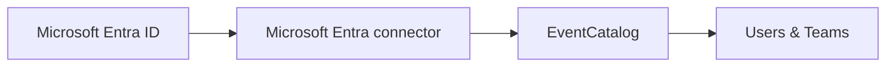

import AddedIn from '@site/src/components/MDX/AddedIn';
import PlanBanner from '@site/src/components/MDX/PlanBanner';

<PlanBanner plan="Scale" />
<AddedIn version="3.45.0" pkg="@eventcatalog/connectors" />

In EventCatalog, you can import and sync your users and teams directly from Microsoft Entra ID. Instead of adding people and teams by hand, you point EventCatalog at selected Entra groups and the catalog keeps those teams and their direct members in sync.



## Why sync from Microsoft Entra ID

Teams and users in EventCatalog are used to assign ownership to resources such as services, events, domains, and more. Many organizations already manage team membership in Microsoft Entra ID. Syncing from Entra keeps ownership data aligned with the directory your organization already maintains.

## How it works

When EventCatalog starts, the connector fetches the configured Entra groups from Microsoft Graph. Each selected group becomes an EventCatalog team, and each direct enabled user member becomes an EventCatalog user.

Synced teams and users appear alongside locally authored users and teams. Each synced entry is marked as read-only and surfaced in directory source badges so people know the source of truth is Microsoft Entra ID.

## Install

```bash
npm install @eventcatalog/connectors
```

## Configure

Import `microsoftEntraDirectory` and add it to the `directory.sources` array in `eventcatalog.config.js`:

```js title="eventcatalog.config.js"
import { microsoftEntraDirectory } from '@eventcatalog/connectors';

export default {
  // ... rest of config
  directory: {
    sources: [
      microsoftEntraDirectory({
        // Directory (tenant) ID from your Microsoft Entra app registration.
        tenantId: process.env.AZURE_TENANT_ID,

        // Application (client) ID from your Microsoft Entra app registration.
        clientId: process.env.AZURE_CLIENT_ID,

        // Client secret value from Certificates & secrets.
        // Use the secret value, not the secret ID.
        clientSecret: process.env.AZURE_CLIENT_SECRET,

        // Entra groups to sync into EventCatalog as teams.
        groups: [
          {
            // Stable Entra group Object ID. Recommended because it is unique and does not change if the group is renamed.
            id: '00000000-0000-0000-0000-000000000000',

            // Optional EventCatalog team id. If omitted, the connector slugifies the Entra group display name.
            alias: 'platform',
          },
          {
            // You can also sync by exact display name. If more than one group matches, use the group Object ID instead.
            displayName: 'Architecture Guild',
          },
        ],
      }),
    ],
  },
};
```

## Microsoft Entra app registration

The connector uses Microsoft Graph with the OAuth client credentials flow.

1. In Azure Portal, open **Microsoft Entra ID**.
2. Go to **App registrations** and create a new app registration.
3. Copy the **Directory (tenant) ID** into `AZURE_TENANT_ID`.
4. Copy the **Application (client) ID** into `AZURE_CLIENT_ID`.
5. Go to **Certificates & secrets** and create a new client secret.
6. Copy the secret **Value** into `AZURE_CLIENT_SECRET`. You do not need the secret ID.
7. Go to **API permissions** and add these Microsoft Graph **Application permissions**:
   - `Group.Read.All` - read the configured groups.
   - `GroupMember.Read.All` - read direct members of the configured groups.
   - `User.Read.All` - read user profile fields for synced members.
8. Grant admin consent for the permissions.

Pass the credentials with environment variables:

```bash
AZURE_TENANT_ID=00000000-0000-0000-0000-000000000000 \
AZURE_CLIENT_ID=00000000-0000-0000-0000-000000000000 \
AZURE_CLIENT_SECRET=your-secret-value \
npx eventcatalog dev
```

## Options

| Option | Type | Required | Description |
|---|---|---|---|
| `tenantId` | `string` | Yes | Microsoft Entra tenant ID. |
| `clientId` | `string` | Yes | Application/client ID for the app registration. |
| `clientSecret` | `string` | Yes | Client secret value for the app registration. |
| `groups` | `(string \| { id: string; alias?: string } \| { displayName: string; alias?: string })[]` | Yes | Entra groups to sync. Group IDs are recommended. |
| `users` | `boolean` | No | When `true` (default), direct members of every synced group are also synced as users. Set to `false` to sync teams only. |
| `includeDisabledUsers` | `boolean` | No | Disabled users are excluded by default. Set to `true` to include them. |
| `graphBaseUrl` | `string` | No | Override the Microsoft Graph base URL. Defaults to `https://graph.microsoft.com/v1.0`. Useful for sovereign cloud environments. |
| `tokenUrl` | `string` | No | Override the OAuth token URL. Defaults to `https://login.microsoftonline.com/{tenantId}/oauth2/v2.0/token`. Useful for sovereign cloud environments. |

## Selecting groups

Groups can be configured by stable group ID:

```js
microsoftEntraDirectory({
  tenantId: process.env.AZURE_TENANT_ID,
  clientId: process.env.AZURE_CLIENT_ID,
  clientSecret: process.env.AZURE_CLIENT_SECRET,
  groups: [
    {
      // Stable Entra group Object ID. Recommended because it is unique and does not change if the group is renamed.
      id: 'e3d11d65-178c-45ff-a9e0-a1d4b74006ff',

      // Optional EventCatalog team id. Use this in owner frontmatter, for example `owners: ['platform-engineering']`.
      alias: 'platform-engineering',
    },
  ],
});
```

You can also configure a group by exact display name:

```js
microsoftEntraDirectory({
  tenantId: process.env.AZURE_TENANT_ID,
  clientId: process.env.AZURE_CLIENT_ID,
  clientSecret: process.env.AZURE_CLIENT_SECRET,
  groups: [
    {
      // Exact Entra group display name. If more than one group has this name, use the group Object ID instead.
      displayName: 'Platform Engineering',

      // Optional EventCatalog team id. If omitted, the connector slugifies the display name.
      alias: 'platform-engineering',
    },
  ],
});
```

Group IDs are recommended because they are stable and unique. If a `displayName` lookup finds no groups or more than one group, EventCatalog stops the build and asks you to use the group ID instead.

## What gets synced

### Teams

Each configured Entra group creates a team entry with:

- `id` set to `alias` when provided, otherwise a slugified version of the Entra group display name.
- `name` taken from the Entra group display name.
- `summary` taken from the Entra group description.
- `email` taken from the Entra group mail address when available.
- `source.provider` set to `microsoft-entra`.
- `source.id` set to the Entra group object ID.
- A read-only note explaining the team is managed in Microsoft Entra ID.

### Users

Users are synced only from the configured groups. When `users` is `true`, every direct enabled user member of each synced group is fetched and created as a user entry with:

- `id` set to the user's mail address when available.
- Guest user principal names such as `name_example.com#EXT#@tenant.onmicrosoft.com` normalized back to `name@example.com` when no mail address is available.
- `id` set to the user's user principal name when no mail address is available and the user is not a guest account.
- `id` set to the Microsoft Graph user object ID when no mail address or user principal name is available.
- `name` taken from the Entra user display name.
- `email` taken from the user's mail address or user principal name.
- `role` taken from the user's job title.
- `source.provider` set to `microsoft-entra`.
- `source.id` set to the Entra user object ID.
- A read-only note explaining the user is managed in Microsoft Entra ID.

Profile photos are not fetched. User avatars are optional in EventCatalog.

:::info Direct members only

The connector syncs direct user members of the configured groups. It does not expand nested groups or transitive membership in this version.

:::

## Use synced owners

Synced teams and users behave identically to hand-authored ones. Reference them by their `id` in any resource frontmatter:

```yaml title="services/order-service/index.md"
---
id: OrderService
name: Order Service
owners:
  - platform-engineering
  - dave@eventcatalog.dev
---
```

## Conflict strategy

When a locally authored user or team shares the same `id` as one returned by the connector, EventCatalog uses the `conflictStrategy` setting to decide what to do.

| Strategy | Behaviour |
|---|---|
| `local-wins` (default) | The local file is kept and the external entry is skipped. |
| `source-wins` | The external entry overwrites the local file. |
| `error` | EventCatalog throws an error and stops the build. |

Configure the strategy in `eventcatalog.config.js`:

```js title="eventcatalog.config.js"
export default {
  // ... rest of config
  directory: {
    conflictStrategy: 'local-wins',
    sources: [ /* ... */ ],
  },
};
```

## Sovereign cloud endpoints

For sovereign cloud environments, override the Graph and token endpoints:

```js
microsoftEntraDirectory({
  tenantId: process.env.AZURE_TENANT_ID,
  clientId: process.env.AZURE_CLIENT_ID,
  clientSecret: process.env.AZURE_CLIENT_SECRET,
  groups: [{ id: '00000000-0000-0000-0000-000000000000' }],
  graphBaseUrl: 'https://graph.microsoft.com/v1.0',
  tokenUrl: 'https://login.microsoftonline.com/<tenant-id>/oauth2/v2.0/token',
});
```
