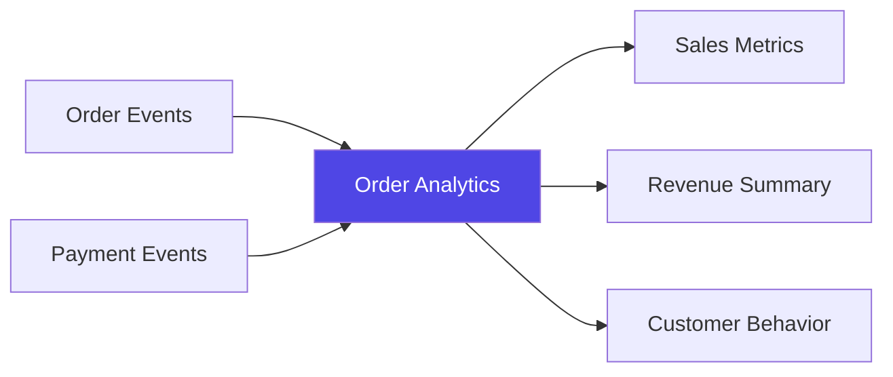
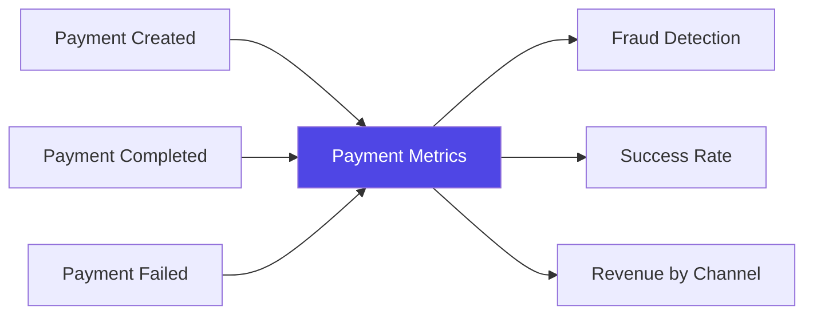
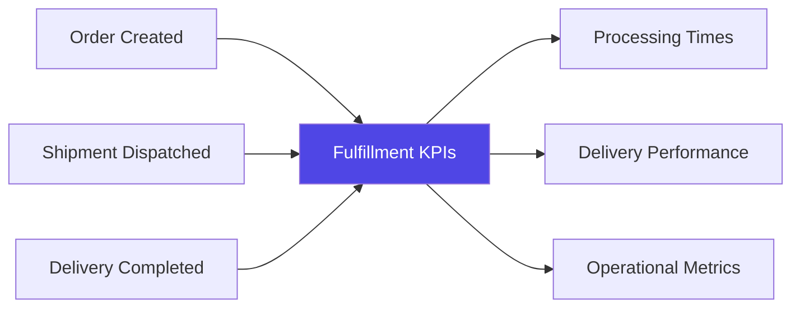

import AddedIn from '@site/src/components/MDX/AddedIn';

Data products in EventCatalog represent analytical datasets that transform raw operational (e.g databases, messages, channels) data into high-quality, discoverable, and reusable information assets.

A data product may consumes inputs (e.g [events](/docs/development/guides/resources/messages/message-types/events), [services](/docs/development/guides/resources/services/introduction), [data stores](/docs/development/guides/resources/data/introduction)) and produces outputs (e.g [data stores](/docs/development/guides/resources/data/introduction), metrics) optimized for specific use cases like reporting, business intelligence, or machine learning.

## Key characteristics

Data products have specific properties that make them distinct:

**Inputs** (input ports) represent source dependencies including events, services, channels, or data stores that feed the data product.

**Outputs** (output ports) represent the analytical assets produced including aggregated tables, metrics streams, or downstream systems that consume the data.

**Contracts** (data contracts) define the schema structure for output datasets. EventCatalog supports any format (e.g JSON Schema, ODCS YAML).

**Ownership** assigns clear accountability with designated teams or individuals responsible for data quality and availability.

## Use cases

Data products are valuable when you need to:

- Document analytical pipelines and their dependencies
- Provide and visualize lineage between data products and their inputs and outputs
- Provide clear contracts for downstream consumers
- Provide clear SLA's and quality metrics for analytical datasets
- Enable self-service data discovery and consumption across teams

## Example scenarios

### Order Analytics

Consumes order and payment events to produce aggregated sales metrics, daily revenue summaries, and customer behavior analysis.

### Payment Metrics

Transforms payment lifecycle events into fraud detection insights, success rate analysis, and revenue attribution by channel.

### Fulfillment KPIs

Combines order, shipment, and delivery events to produce operational metrics like processing times and delivery performance.

## Relationship to other resources

Data products integrate with existing EventCatalog resources:

- **Messages (e.g events) ** can be inputs to data products for real-time processing
- **Services** can also be inputs to data products if your data product consumed it's API for example.
- **Data stores** can be both inputs and outputs for data products
- **Domains** can contain data products as part of their bounded context
- **Channels (e.g Eventbus, Kafka, RabbitMQ)** can but inputs and outputs to data products

## SDK support

Data products are fully supported in the EventCatalog SDK, enabling programmatic creation and management of data product documentation.

Use the SDK to automate data product documentation as part of your CI/CD pipeline or integrate with external analytics platforms.

