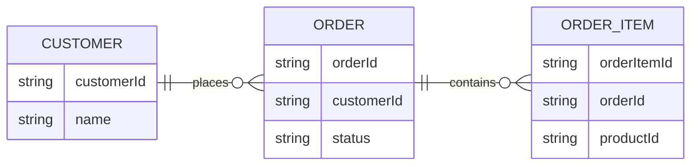

---
keywords:
- EventCatalog entities
- Entity relationships
sidebar_position: 3
sidebar_label: Model relationships
title: Model entity relationships
description: Model relationships between entities in EventCatalog.
---

Entity relationships are defined on entity properties.

Use relationships when one entity property identifies or points to another entity. For example, an `Order` might have a `customerId` property that references `Customer`, and an `OrderItem` might have an `orderId` property that references `Order`.



## Relationship fields

Use these fields on an entity property:

- `references`: The id of the entity being referenced.
- `referencesIdentifier`: The property on the referenced entity that this property matches.
- `relationType`: The relationship label, such as `belongsTo`, `hasOne`, `hasMany`, or a business-specific label.

## Example relationship

```md title="/entities/order/index.mdx"
---
# Unique identifier for the entity. Used in URLs and resource references.
id: order
# Friendly display name shown in EventCatalog.
name: Order
# Version of this entity documentation.
version: 1.0.0
# The property that uniquely identifies this entity.
identifier: orderId
# Properties that describe the shape of the entity.
properties:
  # Unique identifier for this order.
  - name: orderId
    # Data type for the property.
    type: string
    # Whether this property is required.
    required: true
  # Identifier for the customer that placed the order.
  - name: customerId
    # Data type for the property.
    type: string
    # Whether this property is required.
    required: true
    # Human-readable description of what the property represents.
    description: Customer that placed the order.
    # Entity this property references.
    references: customer
    # Label used to describe the relationship in entity maps.
    relationType: placedBy
    # Identifier property on the referenced entity.
    referencesIdentifier: customerId
---
```

This tells EventCatalog that `order.customerId` references the `customer.customerId` identifier.

## Relationship direction

Define the relationship where the reference exists.

If `Order` has a `customerId`, define the relationship on the `customerId` property in `Order`. You do not need to add the inverse relationship to `Customer` unless that relationship is useful to document explicitly.

## Keep relationship labels useful

Use relationship labels that help readers understand the business model.

Good examples include:

- `placedBy`
- `belongsTo`
- `contains`
- `paysFor`
- `shipsTo`

Avoid labels that only repeat implementation detail, such as `foreignKey`.

## Visual output

When entities are attached to a domain or service, EventCatalog can use these relationships to generate an entity map.


## Next steps

- [Add entities to resources](/docs/development/guides/resources/entities/add-entities-to-resources)
- [Visualize entity maps](/docs/development/guides/resources/entities/entity-maps)
