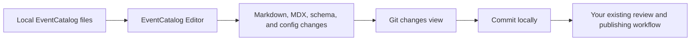

EventCatalog Editor is a local visual editor for maintaining an EventCatalog.

It runs on your machine, opens your catalog from disk, lets you edit architecture resources without working directly in Markdown or MDX, and gives you a Git-backed view of the changes before you commit them.

## Who the editor is for

The editor is for people who maintain an EventCatalog:

- Architects documenting [domains](/docs/development/guides/domains/introduction), [services](/docs/development/guides/resources/services/introduction), [messages](/docs/development/guides/resources/messages/what-are-messages), and [ownership](/docs/owners)
- Developers keeping resource documentation, schemas, and specifications up to date
- Analysts, product owners, or domain experts who can improve catalog content but do not want to edit MDX files directly

You still own your catalog as files. The editor makes those files easier to browse, edit, preview, review, and commit.

::::info Need an EventCatalog first?

These docs assume you already have an EventCatalog project. If you are just getting started, create a catalog first with the [EventCatalog installation guide](/docs/development/getting-started/installation), then come back here.

::::

## What the editor does

Use EventCatalog Editor to:

- Open a local EventCatalog project
- Browse [domains](/docs/development/guides/domains/introduction), [services](/docs/development/guides/resources/services/introduction), [messages](/docs/development/guides/resources/messages/what-are-messages), [channels](/docs/development/guides/resources/messages/message-channels/introduction), [entities](/docs/development/guides/resources/entities/introduction), [data stores](/docs/development/guides/resources/data/introduction), [flows](/docs/development/guides/resources/flows/introduction), [users](/docs/development/guides/owners/what-are-teams-and-users), and [teams](/docs/development/guides/owners/what-are-teams-and-users)
- Edit documentation in a rich editor or source editor
- Update common frontmatter fields through forms
- Add schemas to [events](/docs/development/guides/resources/messages/message-types/events), [commands](/docs/development/guides/resources/messages/message-types/commands), and [queries](/docs/development/guides/resources/messages/message-types/queries)
- Add OpenAPI, AsyncAPI, and GraphQL specifications to domains and services
- Preview resources in a running EventCatalog site
- Inspect local Git changes, view diffs, revert files, and commit work
- Invite editors through [EventCatalog Cloud](https://eventcatalog.cloud) and assign editor seats

## Local workflow

The editor sits on top of the same files that EventCatalog already uses.

The editor does not replace Git, Markdown, MDX, or your deployment process. It gives catalog maintainers a safer interface for making changes before those changes go through the workflow your team already uses.

## Beta status

EventCatalog Editor is in beta. You can use it today, but some workflows and features may change before general availability.

The editor is a seat-based paid product. Community includes 1 editor seat, Starter includes 3 editor seats, Scale includes 10 editor seats, and Enterprise includes unlimited editor seats. See the [pricing page](/pricing) for current plan details.

If you want to help shape the editor, join the [EventCatalog Discord](https://eventcatalog.dev/discord) or [open an issue in the editor repository](https://github.com/event-catalog/eventcatalog-editor-code/issues).

## Next steps

- Follow the [first edit tutorial](/docs/editor/first-edit).
- Learn how to [run the editor locally](/docs/editor/how-to/run-locally).
- Learn how to [use the Flow Editor](/docs/editor/how-to/use-flow-editor).
- Learn how to [invite editors](/docs/editor/how-to/invite-editors).
- Understand [how the editor works](/docs/editor/explanation/how-it-works).
