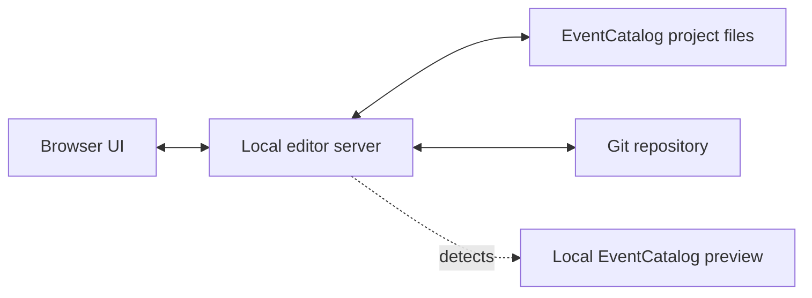

EventCatalog Editor is local-first.

It starts a small local server, opens a browser UI, reads your EventCatalog project from disk, and writes changes back to the same files.

## The editor runs on your machine

The editor binds to your local machine and opens at [http://localhost:3900](http://localhost:3900) by default.

Your catalog stays on disk. Editing a resource changes files in the catalog directory, such as `index.mdx`, schema files, specification files, or `eventcatalog.config.js`.

## The browser talks to the local server

The browser UI does not edit files directly. It talks to the local editor server, which:

- Validates catalog paths
- Reads resources
- Writes resource files
- Manages schema and specification files
- Reads Git status and diffs
- Detects local EventCatalog preview URLs

## [EventCatalog Cloud](https://eventcatalog.cloud) controls access

The beta editor uses [EventCatalog Cloud](https://eventcatalog.cloud) for sign-in and editor access.

Organizations in [EventCatalog Cloud](https://eventcatalog.cloud) control which people can open the local editor. Admins and editors can start local editor sessions. Viewers can belong to an organization without using an editor seat, but they cannot open a local editor session.

After sign-in, editing still happens locally. The editor does not become a hosted catalog editor; it remains a local tool pointed at your local catalog files.

## Git remains the review boundary

The editor shows local Git changes, diffs, revert actions, and commits.

It does not replace your team's review and release process. After committing, push and publish the catalog the same way your team already does.
