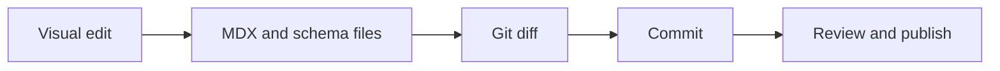

EventCatalog is file-based. The editor keeps that model.

Instead of asking every contributor to edit Markdown, MDX, YAML frontmatter, schemas, and Git diffs by hand, the editor gives them a visual workflow on top of the same project files.

## Markdown and MDX are still the source of truth

Each EventCatalog resource is still represented by files in your catalog.

For example, a [service](/docs/development/guides/resources/services/introduction) might live at:

```txt
domains/Orders/services/OrderService/index.mdx
```

When you edit that service in the editor, the editor updates the same file.

## Visual editing is an authoring layer

The editor helps with common tasks:

- Writing documentation
- Changing summaries and owners
- Adding badges
- Modeling relationships
- Adding schemas and specifications
- Managing draft status

For advanced content, source mode lets you edit the underlying Markdown, MDX, and frontmatter.

## Git shows exactly what changed

Because the editor writes to files, Git can show the exact change.

That makes the editor useful for contributors who prefer a visual workflow while still giving reviewers the normal file diff.



## Why this matters

This keeps EventCatalog portable:

- You can still edit files in an IDE
- You can still review changes in pull requests
- You can still build and deploy with your existing pipeline
- You can let non-MDX contributors improve documentation safely
