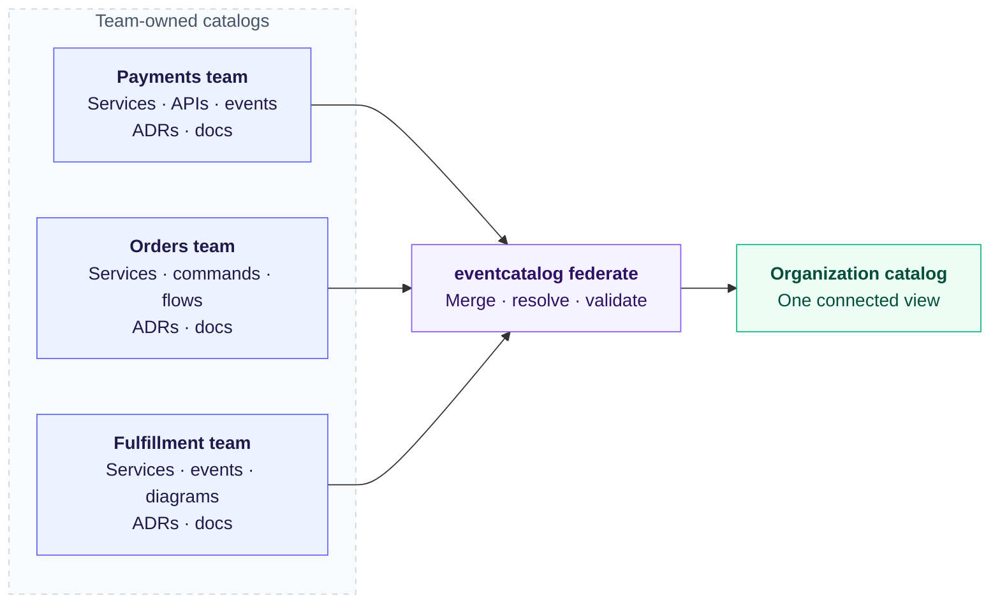
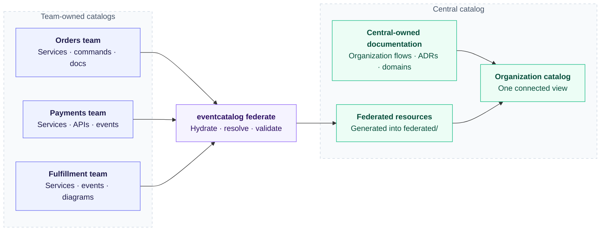

import EventCatalogEnterprise from '@site/src/components/MDX/EventCatalogEnterprise';

<EventCatalogEnterprise />

EventCatalog Federation is a solution for distributed documentation across your organization. Teams document and own their services, domains, messages, ADRs, specifications, schemas, diagrams, and everything else EventCatalog supports in their own catalogs, while Federation combines them into one organization-wide view.

Each team keeps its documentation, ownership, and review workflow in its own EventCatalog project. A central catalog selects those catalogs, validates them together, and materializes their resources as one connected catalog.

<div className="federation-mermaid">



</div>

Federation is useful when one catalog repository or one documentation team would become a bottleneck. Each team can document its part of the architecture close to the people and code that own it, while the organization still gets one place to discover resources and follow relationships.

## What Federation gives you

Use Federation to:

- Combine resources from multiple EventCatalog projects
- Resolve relationships between catalogs
- Validate organization-wide ownership and resource types
- Include schemas, specifications, sidecar documentation, public assets, and custom components
- Test federation against local catalogs before using remote sources
- Fetch public or private catalogs from GitHub
- Treat selected diagnostics as warnings, errors, or disabled rules
- Keep the previous generated output when an update fails

## The central catalog is still an EventCatalog

The central catalog can own organization-wide documentation of its own, such as cross-domain flows, shared architecture decisions, or enterprise domains. Its local resources participate in the same ownership validation as federated resources.

<div className="federation-mermaid">



</div>

The generated content is written to `federated/`. The normal EventCatalog development server or build then reads the local and federated resources together.

## Federation is explicit

The current workflow has two separate commands:

```bash
npx eventcatalog federate
npm run build
```

`eventcatalog federate` fetches, validates, and materializes the configured sources. `npm run build` renders the resulting catalog. Federation does not run automatically before `dev`, `build`, or `generate`.

:::info Enterprise feature

EventCatalog Federation requires an EventCatalog Enterprise offline license. To try it, email [hello@eventcatalog.dev](mailto:hello@eventcatalog.dev?subject=EventCatalog%20Federation%20Trial) and we will send you an offline trial key. Save the `license.jwt` file in the root of your central catalog before running Federation.

Learn more about [offline license validation](/docs/development/license-keys/license-validation#offline-validation).

:::

## Built-in Federation and the Federation generator

These docs describe the built-in `eventcatalog federate` workflow. It uses catalog indexes, graph validation, content hashes, and generated federation output.

It is different from the older `@eventcatalog/generator-federation` integration, which clones repositories and copies configured directories through the generator pipeline.

## Current release status

Federation is being released as an initial working version for feedback. The core composition and validation workflow is ready to use, while operational features such as automatic build integration, source management commands, frozen lockfile installs, and local file watching may evolve from user feedback.

Read [MVP status and feedback](/docs/federation/explanation/mvp-status-and-feedback) for the current boundaries.

## Next steps

- Follow the [first federation tutorial](/docs/federation/first-federation).
- Learn [how Federation works](/docs/federation/explanation/how-it-works).
- [Configure GitHub sources](/docs/federation/how-to/configure-github-sources).
- [Use local catalogs during development](/docs/federation/how-to/use-local-sources).
- Look up the complete [configuration reference](/docs/federation/reference/configuration).
- Review the [diagnostic rule reference](/docs/federation/reference/diagnostic-rules).
