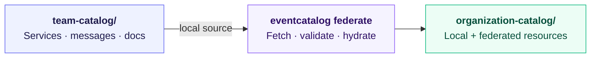

import EventCatalogEnterprise from '@site/src/components/MDX/EventCatalogEnterprise';

<EventCatalogEnterprise />

This tutorial takes you through the first successful Federation workflow:

1. Create a team catalog
2. Create an empty organization catalog
3. Configure the team catalog as a local source
4. Run Federation
5. Open the combined catalog

The goal is to learn the federation loop before introducing GitHub, CI, or organization-wide validation rules.

## What you will build

<div className="federation-mermaid">



</div>

## Prerequisites

Before you start, make sure you have:

- [Node.js 22 or later](https://nodejs.org/en/download/)
- Git installed
- An EventCatalog Enterprise offline license. Email [hello@eventcatalog.dev](mailto:hello@eventcatalog.dev?subject=EventCatalog%20Federation%20Trial) to request a trial key.
- A terminal and text editor

Check Node and Git with:

```bash
node -v
git --version
```

## Create the tutorial catalogs

Create a directory for the tutorial:

```bash
mkdir federation-tutorial
cd federation-tutorial
```

Create a team catalog with the sample resources included by the EventCatalog installer:

```bash
npx @eventcatalog/create-eventcatalog@latest team-catalog
```

Create an empty catalog that will become the organization view:

```bash
npx @eventcatalog/create-eventcatalog@latest organization-catalog --empty
```

You now have two sibling projects:

```text
federation-tutorial/
├── team-catalog/
└── organization-catalog/
```

## Add your Enterprise license

Federation uses an offline Enterprise license. Save the `license.jwt` file we send you in the root of the organization catalog:

```text
organization-catalog/
├── license.jwt
├── eventcatalog.config.js
└── package.json
```

To try Federation, email [hello@eventcatalog.dev](mailto:hello@eventcatalog.dev?subject=EventCatalog%20Federation%20Trial) and ask for an offline trial key. You can commit `license.jwt` with the central catalog so it is available locally and in CI/CD. If your organization prefers not to commit it, provide the file during your CI/CD job instead.

## Configure the local source

Open `organization-catalog/eventcatalog.config.js` and add `federation.sources` to the exported configuration:

```js title="organization-catalog/eventcatalog.config.js"
export default {
  // Keep the settings created by the installer...
  federation: {
    sources: [
      {
        id: 'tutorial/team-catalog',
        source: 'file:../team-catalog',
      },
    ],
  },
};
```

The source path is relative to the organization catalog. The `id` is the stable identity Federation uses for ownership, generated paths, and diagnostics.

## Ignore generated output

Add the generated federation directory and cache to `organization-catalog/.gitignore`:

```gitignore title="organization-catalog/.gitignore"
federated/
.eventcatalog-cache/
```

Do not edit files under `federated/`. Federation replaces that directory on a successful run.

## Run Federation

Move into the organization catalog and run the command:

```bash
cd organization-catalog

# If this does not work, add federate script in your package.json "federate: eventcatalog federate"
npm run federate
```

A successful run ends with output similar to:

```text
[federation] Graph resolved: 20 remote resources, 28 relationships
[federation] Federation complete: 1 source, 20 remote resources, 35 files written
[federation] Recorded resolved source state in eventcatalog.lock
```

The exact resource and file counts depend on the current starter catalog.

Federation has now created:

- `federated/` containing the team catalog resources
- `.eventcatalog-cache/federation/content/` containing verified reusable content
- `eventcatalog.lock` recording the source state resolved by this run

## Open the organization catalog

Start the organization catalog:

```bash
npm run dev
```

Open [http://localhost:3000](http://localhost:3000). The resources from `team-catalog` now appear in the organization catalog.

## Make a source change

Stop the development server, then change the name or documentation of a resource in `team-catalog`.

Run Federation again from `organization-catalog`:

```bash
npx eventcatalog federate
```

Start the development server again. The organization view now contains the updated source content.

Local filesystem sources are one-shot inputs. You need to rerun `eventcatalog federate` after a source changes.

## What you learned

You have completed the core federation loop:

- A team catalog owns its source documentation
- The organization catalog selects it through configuration
- Federation indexes, validates, and materializes the source
- The normal EventCatalog application renders the combined view
- Rerunning Federation updates the generated output

Next, learn how to [configure GitHub sources](/docs/federation/how-to/configure-github-sources), [resolve relationships across catalogs](/docs/federation/explanation/ownership-and-references), or [run Federation in CI](/docs/federation/how-to/run-in-ci).
