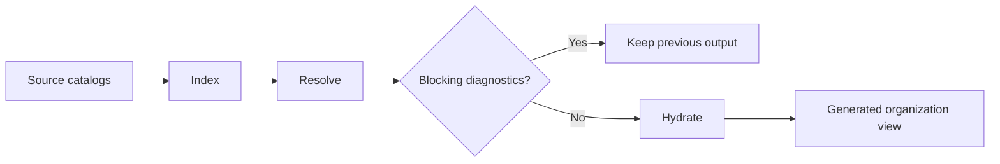
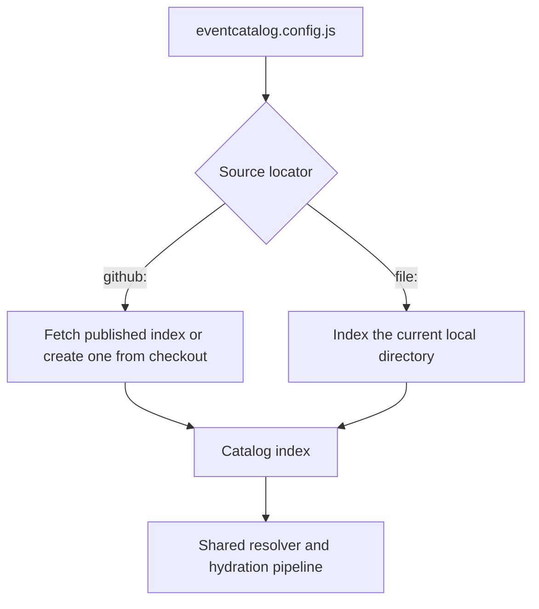

import EventCatalogEnterprise from '@site/src/components/MDX/EventCatalogEnterprise';

<EventCatalogEnterprise />

EventCatalog Federation is a build-time composition process.

It reads independently owned catalogs, converts them into a common index, validates the combined graph, and writes generated catalog files that the normal EventCatalog application can render.

## The three-stage pipeline

<div className="federation-mermaid">



</div>

### Index

Each source catalog is described as facts:

- Resource IDs, types, and versions
- Resource ownership and relationships
- Content paths and hashes
- Schemas and specifications
- Sidecar documentation
- Public assets and custom components

Federation operates on EventCatalog's existing files and frontmatter. Teams do not maintain a second federation-specific resource definition.

### Resolve

Federation combines the indexes into one graph. The resolver:

- Connects relationships across source boundaries
- Selects resource versions for relationship pointers
- Detects multiple owners for one resource ID
- Detects conflicting resource types
- Detects relationship type mismatches
- Identifies missing resources and unavailable versions
- Chooses a deterministic winner for remote asset collisions

The central catalog's local resources participate in ownership validation. A local flow or architecture decision can point to federated resources, while a local resource can also conflict with a remote owner.

### Hydrate

After validation succeeds, Federation fetches the selected resource files and writes them under `federated/`.

Schemas, specifications, sidecars, public assets, and custom components travel with their owning resources. Content hashes are checked before files are accepted.

The normal EventCatalog build then reads local and federated content together.

## How sources are acquired

Federation currently supports GitHub and local filesystem sources.

<div className="federation-mermaid">



</div>

A GitHub source can publish `catalog.index.json`. If the file exists, Federation checks its source ID and uses it. If the file does not exist, Federation creates an index from a temporary checkout.

A filesystem source is indexed directly. Its revision is derived from the indexed content so the completed run can record which local state it used.

After source acquisition, both source types use the same validation, hydration, caching, asset, and lockfile behavior.

## Federation materializes files

Federation does not make live requests to team catalogs when somebody opens the organization site.

The generated files are a local representation of the last successful federation run:

```text
central-catalog/
├── domains/                  # centrally owned resources
├── federated/                # generated source resources
├── public/                   # central and managed remote assets
├── eventcatalog.lock         # completed-run receipt and managed asset state
└── .eventcatalog-cache/      # reusable verified content
```

This means the organization catalog can be built and deployed through the same process as any other EventCatalog after Federation completes.

## Failed updates preserve the previous view

Federation validates the graph before hydration. Output changes are staged, and the lockfile is written after the generated resources and public assets are composed.

If a normal update fails while installing new output, Federation attempts to restore the previous `federated/` directory and affected public assets. A bad source update should not replace the last successful organization view with partial output.

## Federation is explicit

The federation command and EventCatalog build are separate:

```bash
npx eventcatalog federate
npm run build
```

This keeps source acquisition and graph validation visible in local workflows and CI. The current release does not automatically federate before `dev`, `build`, or `generate`.

## Related guides

- [Ownership and cross-catalog references](/docs/federation/explanation/ownership-and-references)
- [Lockfile and cache](/docs/federation/explanation/lockfile-and-cache)
- [Generated output reference](/docs/federation/reference/generated-output)
