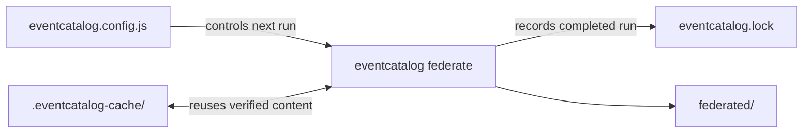

import EventCatalogEnterprise from '@site/src/components/MDX/EventCatalogEnterprise';

<EventCatalogEnterprise />

Federation writes two kinds of local state:

- `eventcatalog.lock` records the source state and managed public files from a completed run.
- `.eventcatalog-cache/` stores verified content that can be reused by later runs.

They solve different problems.

<div className="federation-mermaid">



</div>

## What the lockfile records

For each source, `eventcatalog.lock` records:

- The stable source ID
- The Git commit or content-derived local revision used by the run
- A digest of the resolved source index
- The time the source was resolved

It also records the hash and source of public files managed by Federation. This allows a later run to update or remove generated public files without deleting files owned or modified by the central catalog.

A simplified lockfile looks like:

```json title="eventcatalog.lock"
{
  "lockVersion": 1,
  "sources": [
    {
      "id": "acme/payments",
      "digest": "sha256:...",
      "commit": "4a1b7e23c79b4ef9f5f337c5e7655a5ec82a4761",
      "resolvedAt": "2026-08-21T10:30:00.000Z"
    }
  ],
  "publicFiles": {
    "payments/payment-flow.svg": {
      "source": "acme/payments",
      "hash": "sha256:..."
    }
  }
}
```

## The lockfile does not control the next run

The current lockfile is a completed-run receipt and managed-output record. It is not read as a package-manager-style source lock.

Every Federation run:

- Resolves the configured GitHub `ref` again
- Re-indexes the current files for a `file:` source
- Writes a new lockfile after the update succeeds

If `ref` is `main`, a later run can select a newer commit. To make a source repeatable, configure `ref` as an exact commit SHA.

:::warning Do not describe the current lockfile as a pin

The commit in `eventcatalog.lock` tells you what the completed run used. It does not force the next run to use that commit.

:::

## Should the lockfile be committed?

It is safe to commit `eventcatalog.lock` when you want:

- An auditable record of the last completed federation run
- Managed public-file state shared between environments
- Source revisions visible during code review

Expect a moving branch or edited local source to update the lockfile. Committing it does not by itself make future builds repeatable.

## How the content cache works

Federation stores content under:

```text
.eventcatalog-cache/
└── federation/
    └── content/
```

Cache entries are addressed by SHA-256 content hashes. Before reusing an entry, Federation calculates its hash again. A corrupt or mismatched entry is discarded instead of being hydrated.

The cache avoids downloading identical resource files, schemas, specifications, sidecars, and assets on every run.

## Ignore or persist the cache

Add the cache to `.gitignore`:

```gitignore
.eventcatalog-cache/
```

The cache is disposable. You can remove it when you need to reclaim disk space; the next run downloads the required content again.

The current release does not prune old content automatically, so a long-lived cache can grow as source content changes.

Persisting `.eventcatalog-cache` in CI can improve repeat build times, but it is not required for correctness.

## Refresh cached content

Use `--no-cache` to disable cache reads for one run:

```bash
npx eventcatalog federate --no-cache
```

Federation fetches the required content and writes valid content back to the cache. The option refreshes cache entries; it does not permanently disable caching.

## Related guides

- [Run Federation in CI](/docs/federation/how-to/run-in-ci)
- [Generated output reference](/docs/federation/reference/generated-output)
- [CLI reference](/docs/federation/reference/cli)
