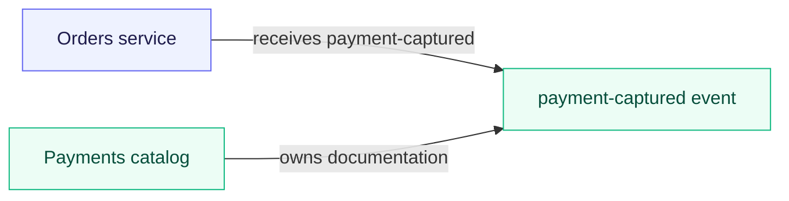
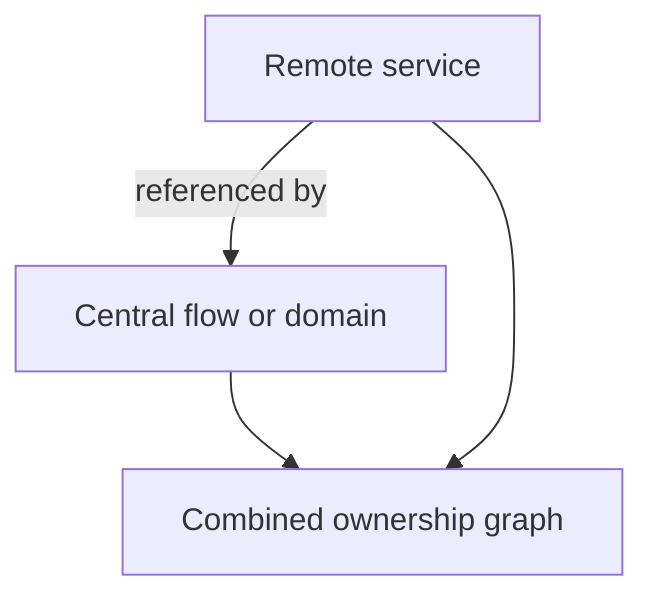
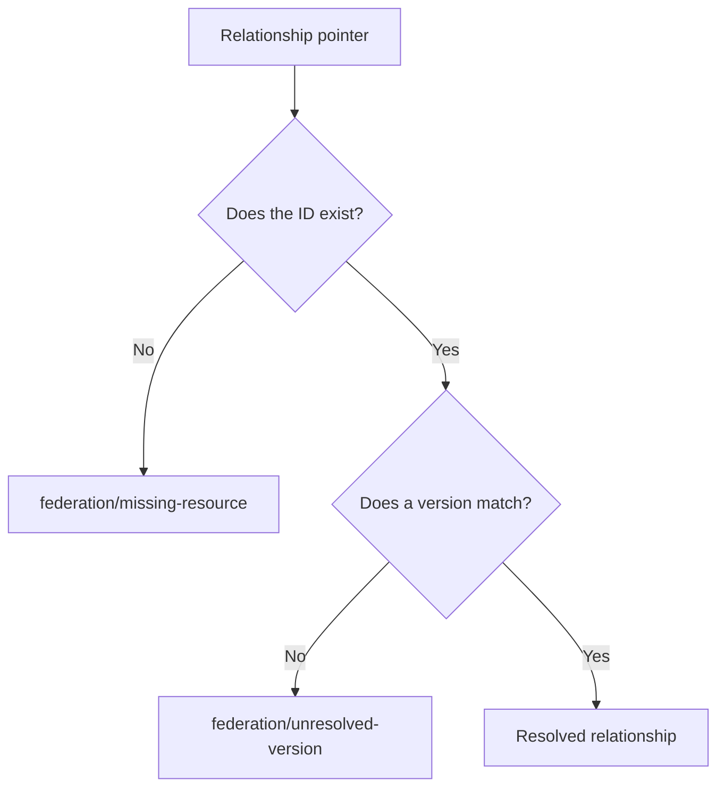

import EventCatalogEnterprise from '@site/src/components/MDX/EventCatalogEnterprise';

<EventCatalogEnterprise />

Federation separates **owning a resource** from **referring to a resource**.

A catalog owns a resource when it contains the resource documentation. Other catalogs can use normal EventCatalog relationship pointers to refer to that ID without copying its definition.

## One resource, one owner

Resource IDs are organization-wide in a federated view.

If Payments owns `payment-captured`, another catalog should not create a second `payment-captured` event as a placeholder. It should point to the owner's ID.

<div className="federation-mermaid">



</div>

The same owner should document every version of an ID. Splitting version `1.0.0` and version `2.0.0` across catalogs is still multiple ownership.

## Relationships stay in normal frontmatter

Teams keep authoring `sends`, `receives`, domain membership, flow steps, and other EventCatalog relationships as they do in a standalone catalog.

For example, an Orders service can receive an event owned by Payments:

```yaml
---
id: order-service
name: Order Service
version: 1.0.0
receives:
  - id: payment-captured
    version: 1.0.0
---
```

The Orders catalog does not need a local event file for `payment-captured`. When both catalogs participate in the central view, Federation connects the relationship to the Payments resource.

## Central resources participate too

The central catalog can own local resources. Those resources are included when Federation validates ownership and resolves relationships from remote catalogs.

<div className="federation-mermaid">



</div>

This allows organization-wide flows and architecture decisions to refer to team-owned services and messages without copying them into the central repository.

## How versions resolve

Relationship pointers can select:

| Pointer | Resolution |
| --- | --- |
| No version | Highest available version |
| `latest` | Highest available version |
| Exact version such as `1.2.0` | That version only |
| Semantic range such as `^1.2.0` | Highest available version satisfying the range |

If the ID exists but the requested version cannot be selected, Federation reports `federation/unresolved-version` with the requested and available versions.

## Missing resource and unresolved version are different

<div className="federation-mermaid">



</div>

- **Missing resource** means no participating catalog documents the target ID.
- **Unresolved version** means an owner exists, but it does not publish a matching version.

Both are warnings by default so organizations can onboard catalogs gradually. They can be promoted to errors with [Federation rules](/docs/federation/how-to/configure-validation-rules).

## Ambiguous ownership blocks by default

Federation reports structural errors when:

- Several catalogs own the same resource ID
- The same ID is documented as different resource types
- A relationship expects one resource type but finds another
- Catalogs provide contradictory facets for one resource

These problems have no unambiguous organization-wide interpretation, so their rules default to `error`.

## Ownership conventions to agree on

Before onboarding many catalogs, agree that:

- Every resource ID has one owning catalog
- The owner keeps all versions of the resource
- Consumers point to the owner rather than creating placeholders
- Shared teams and users have one source of truth
- Central documentation uses unique IDs for resources it owns
- Teams coordinate any intentionally shared asset or component paths

## Related guides

- [Configure validation rules](/docs/federation/how-to/configure-validation-rules)
- [Diagnostic rule reference](/docs/federation/reference/diagnostic-rules)
- [Troubleshooting ownership problems](/docs/federation/reference/troubleshooting#ownership-and-type-errors)
