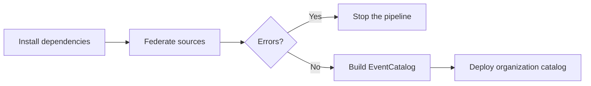

import EventCatalogEnterprise from '@site/src/components/MDX/EventCatalogEnterprise';

<EventCatalogEnterprise />

Run Federation before the normal EventCatalog build so the generated organization view exists when EventCatalog renders the site.

## Add explicit scripts

Add separate and combined scripts to the central catalog:

```json title="package.json"
{
  "scripts": {
    "federate": "eventcatalog federate",
    "build": "eventcatalog build",
    "build:federated": "npm run federate && npm run build"
  }
}
```

Keeping `federate` and `build` separate makes it clear which stage failed. The combined script is useful for deployment platforms that accept one build command.

## Provide your Enterprise license and repository tokens

Federation requires an EventCatalog Enterprise offline license. Email [hello@eventcatalog.dev](mailto:hello@eventcatalog.dev?subject=EventCatalog%20Federation%20Trial) to request a trial key.

The simplest option is to commit `license.jwt` in the central catalog root. Federation will find it automatically when CI runs. If your organization prefers not to commit the file, store its contents in your CI provider and write `license.jwt` during the job. Set `EC_LICENSE` only when you write the file somewhere other than the catalog root.

Provide these environment variables when needed:

| Variable | When it is needed |
| --- | --- |
| `EC_LICENSE` | Optional path to the Enterprise offline license file when it is not stored at `./license.jwt` |
| `EVENTCATALOG_GITHUB_TOKEN` | Recommended for private GitHub sources |
| `GITHUB_TOKEN` | Used as a fallback when `EVENTCATALOG_GITHUB_TOKEN` is not set |

GitHub tokens need read access to the configured repositories. Store those tokens in your CI provider's secret store rather than in `eventcatalog.config.js`.

## Run the pipeline

The CI sequence is:

```bash
npm ci
npm run federate
npm run build
```

or:

```bash
npm ci
npm run build:federated
```

<div className="federation-mermaid">



</div>

## Choose moving or immutable refs

A branch such as `main` makes CI pick up new source commits whenever Federation runs. This is useful when the organization catalog should continuously follow each team.

An exact commit SHA makes the configured source repeatable:

```js title="eventcatalog.config.js"
{
  id: 'acme/payments',
  source: 'github:acme/payments-catalog',
  ref: '4a1b7e23c79b4ef9f5f337c5e7655a5ec82a4761',
}
```

`eventcatalog.lock` records the source state selected by a completed run, but it does not control the next run. Use immutable `ref` values when repeatability is required.

## Decide which warnings should block CI

Promote important warning rules to `error` in the central configuration:

```js title="eventcatalog.config.js"
export default {
  federation: {
    rules: {
      'federation/missing-resource': 'error',
      'federation/unresolved-version': 'error',
    },
    sources: [/* ... */],
  },
};
```

This makes the federation command return an error before installing new output when a configured rule is violated.

Review [Configure validation rules](/docs/federation/how-to/configure-validation-rules) before changing structural errors to warnings.

## Cache downloaded content

Federation stores verified content in `.eventcatalog-cache/federation/content/`. Persisting `.eventcatalog-cache` with your CI cache can reduce repeated downloads.

Treat the cache as disposable. Federation checks content hashes before reuse and downloads content again when a valid entry is unavailable.

Use `--no-cache` when investigating a cache problem:

```bash
npm run federate -- --no-cache
```

## Preserve useful failure output

Errors always include their details. Warning details require `--verbose`:

```bash
npm run federate -- --verbose
```

Consider using verbose output in CI while Federation is being introduced, then switch back to the concise output if the logs become noisy.

## Next steps

- [Configure GitHub sources](/docs/federation/how-to/configure-github-sources)
- [Configure validation rules](/docs/federation/how-to/configure-validation-rules)
- [Understand the lockfile and cache](/docs/federation/explanation/lockfile-and-cache)
