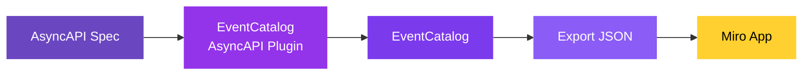

If you have AsyncAPI specifications, you can import them into Miro through EventCatalog. The [AsyncAPI plugin](/docs/plugins/asyncapi/intro) generates services, messages, and channels from your specs — which you can then drag onto a Miro board to visualize and design with your team.

### How it works



1. **AsyncAPI Spec** — your existing AsyncAPI specification files (YAML or JSON)
2. **EventCatalog AsyncAPI Plugin** — parses your specs and generates EventCatalog resources
3. **EventCatalog** — your catalog now contains services, events, commands, queries, and channels from your specs
4. **Export JSON** — run `npm run export` to generate the catalog JSON
5. **Miro App** — import the JSON and drag your resources onto the board

### What gets generated

The AsyncAPI plugin creates the following resources from your specifications:

- **Services** — each AsyncAPI spec maps to a service
- **Messages** — operations become events, commands, or queries (configurable via extensions)
- **Channels** — AsyncAPI channels are mapped to EventCatalog channels with routing information
- **Schemas** — message payloads are preserved as schemas in your catalog

All relationships between services, messages, and channels are maintained — so when you drag a service onto the Miro board with dependencies enabled, you'll see the full message flow.

### Getting started

#### 1. Install the AsyncAPI plugin

```bash
npm install @eventcatalog/generator-asyncapi
```

#### 2. Configure the plugin

Add the plugin to your `eventcatalog.config.js`:

```js
generators: [
  [
    '@eventcatalog/generator-asyncapi',
    {
      services: [
        { id: 'my-service', path: './asyncapi.yml' },
      ],
      domain: { id: 'my-domain', name: 'My Domain', version: '1.0.0' },
    },
  ],
],
```

#### 3. Generate your catalog

```bash
npm run generate
```

#### 4. Export and import into Miro

```bash
npm run export
```

Then open the Miro app and [import the JSON](/docs/miro/connecting-to-eventcatalog).

### Learn more

For full plugin configuration, features, and extensions, see the [AsyncAPI plugin documentation](/docs/plugins/asyncapi/intro).
