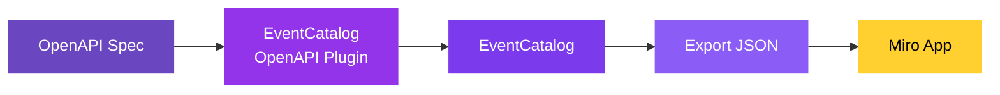

If you have OpenAPI specifications, you can import them into Miro through EventCatalog. The [OpenAPI plugin](/docs/plugins/openapi/intro) generates services and messages from your specs — which you can then drag onto a Miro board to visualize and design with your team.

### How it works



1. **OpenAPI Spec** — your existing OpenAPI specification files (YAML or JSON)
2. **EventCatalog OpenAPI Plugin** — parses your specs and generates EventCatalog resources
3. **EventCatalog** — your catalog now contains services and messages from your API definitions
4. **Export JSON** — run `npm run export` to generate the catalog JSON
5. **Miro App** — import the JSON and drag your resources onto the board

### What gets generated

The OpenAPI plugin creates the following resources from your specifications:

- **Services** — each OpenAPI spec maps to a service (or multiple specs can map to one service)
- **Messages** — API operations become events, commands, or queries based on HTTP method (configurable)
- **Schemas** — request/response schemas are preserved in your catalog
- **Consumer services** — optionally define which services consume specific API routes

All relationships between services and messages are maintained — so when you drag a service onto the Miro board with dependencies enabled, you'll see the full API flow.

### Getting started

#### 1. Install the OpenAPI plugin

```bash
npm install @eventcatalog/generator-openapi
```

#### 2. Configure the plugin

Add the plugin to your `eventcatalog.config.js`:

```js
generators: [
  [
    '@eventcatalog/generator-openapi',
    {
      services: [
        { id: 'my-api', path: './openapi.yml' },
      ],
      domain: { id: 'my-domain', name: 'My Domain', version: '1.0.0' },
    },
  ],
],
```

#### 3. Generate your catalog

```bash
npm run generate
```

#### 4. Export and import into Miro

```bash
npm run export
```

Then open the Miro app and [import the JSON](/docs/miro/connecting-to-eventcatalog).

### Learn more

For full plugin configuration, features, and extensions, see the [OpenAPI plugin documentation](/docs/plugins/openapi/intro).
