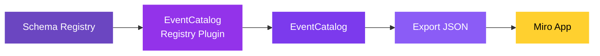

If your organization uses a schema registry, you can import your schemas into EventCatalog and use them in Miro. EventCatalog supports several popular schema registries out of the box — and you can build your own using the SDK.

### How it works



1. **Schema Registry** — your existing registry containing message schemas
2. **EventCatalog Registry Plugin** — connects to your registry and generates EventCatalog resources
3. **EventCatalog** — your catalog now contains services, messages, and schemas from your registry
4. **Export JSON** — run `npm run export` to generate the catalog JSON
5. **Miro App** — import the JSON and drag your resources onto the board to model your architecture

### Supported registries

EventCatalog has plugins for the following schema registries:

| Registry | Plugin | Description |
|----------|--------|-------------|
| [Confluent Schema Registry](/docs/plugins/confluent-schema-registry/intro) | `@eventcatalog/generator-confluent-schema-registry` | Import Avro, JSON Schema, and Protobuf schemas from Confluent |
| [AWS Glue Schema Registry](/docs/plugins/aws-glue-registry/intro) | `@eventcatalog/generator-aws-glue-schema-registry` | Import schemas from AWS Glue |
| [Amazon EventBridge](/integrations/amazon-eventbridge) | `@eventcatalog/generator-amazon-eventbridge` | Import event schemas from EventBridge Schema Registry |
| [Apicurio Registry](/integrations/apicurio) | `@eventcatalog/generator-apicurio` | Import schemas from Apicurio Registry |
| [Azure Schema Registry](/docs/plugins/azure-schema-registry/intro) | `@eventcatalog/generator-azure-schema-registry` | Import schemas from Azure Schema Registry |
| [GitHub](/integrations/github) | `@eventcatalog/generator-github` | Use a GitHub repository as a schema registry |

### Custom registries

If your registry isn't listed above, you can build your own plugin using the [EventCatalog SDK](/docs/sdk). The SDK gives you full control over how schemas are fetched, parsed, and mapped to EventCatalog resources.

### Getting started

Each registry plugin follows the same pattern:

#### 1. Install the plugin

```bash
npm install @eventcatalog/generator-<your-registry>
```

#### 2. Configure the plugin

Add the plugin to your `eventcatalog.config.js`:

```js
generators: [
  [
    '@eventcatalog/generator-<your-registry>',
    {
      // Plugin-specific configuration
      // See the plugin docs for details
    },
  ],
],
```

#### 3. Generate your catalog

```bash
npm run generate
```

#### 4. Export and import into Miro

```bash
npm run export
```

Then open the Miro app and [import the JSON](/docs/miro/connecting-to-eventcatalog). Your schemas and messages will be available to drag onto the board, connect to services, and use in your architecture design sessions.
