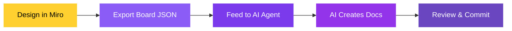

The real power of the Miro app is the round-trip: **import your architecture, design what comes next, then push it all back into EventCatalog**, with AI handling the documentation for you.

### The value

When you design on a Miro board, you're making architecture decisions: new services, new events, new connections. Normally, turning those decisions into documented, structured catalog entries is manual work. With [EventCatalog Skills](https://github.com/event-catalog/skills), an AI agent does it for you:

- **Model with real artifacts.** Start from your actual architecture, not a blank canvas
- **Draft the future.** Create new services, events, and connections on the board before they exist in code
- **Pull it back automatically.** Export the board and let AI create the documentation, frontmatter, folder structure, and relationships in your catalog

No copy-pasting. No manually creating files. The AI reads your Miro board export and generates properly structured EventCatalog documentation.

### How it works



### Walkthrough

#### 1. Design your architecture in Miro

Import your existing catalog, then make changes. Add new services, draw new connections, rename resources, sketch out a future state. Everything you'd normally do in a design session with your team.

#### 2. Export the board

Click **Export to JSON** on the dashboard. This downloads a `miro-board-export.json` file containing everything on the board: resources, connections, positions, and labels.

#### 3. Install EventCatalog Skills

If you haven't already, add the skills to your project:

```bash
npx skills add event-catalog/skills
```

These skills teach your AI agent how to create and update EventCatalog documentation: proper frontmatter, folder structure, naming conventions, and resource relationships.

#### 4. Feed the export to your AI agent

Open your AI agent (e.g. Claude, Cursor, Windsurf) in your EventCatalog project and give it the export:

```
Here is the Miro board export from our architecture design session.

Please update my EventCatalog to reflect the changes:
- Add any new services, events, commands, or queries we created
- Update connections between services and messages
- Create documentation for all new resources

<attach or paste miro-board-export.json>
```

The AI will:
- Parse the board items (cards, sticky notes) and connectors
- Identify new resources that need catalog entries
- Map connections to EventCatalog relationships (sends, receives, writesTo, readsFrom)
- Generate MDX files with correct frontmatter and folder structure
- Cross-reference existing resources to avoid duplicates

#### 5. Review and commit

The AI creates files directly in your EventCatalog project. Review the changes, then commit:

```bash
git add .
git commit -m "Update architecture from Miro design session"
```

Open a pull request if your team reviews architecture changes, just like code.

### Example

Say your team designs a new `NotificationService` on the Miro board that consumes an `OrderCompleted` event and sends an `EmailSent` event. After exporting and running through AI, you'd get:

- `services/NotificationService/index.md` with frontmatter linking to the events it sends and receives
- `events/EmailSent/index.md` with schema, summary, and producer information
- Updated `events/OrderCompleted/index.md` with `NotificationService` added as a consumer

All properly structured, all linked, all ready for your team to review.

### Tips

- **Be specific in your prompt.** Tell the AI what changed in this session so it knows what to focus on
- **Attach the full export.** The AI needs the complete board state to understand connections
- **Review before committing.** AI is great at structure and boilerplate, but you should verify the details match your team's decisions
- **Use with pull requests.** Treat architecture documentation changes like code changes for team visibility
