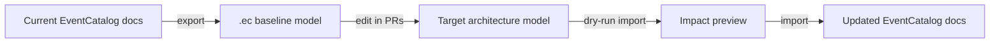

This guide is for architects who want to design a target architecture before teams start building. You can take existing EventCatalog resources, export them to `.ec` models, and then iterate on future-state ideas in Git.



## Why use this workflow

- Start from real architecture, not a blank page.
- Design future-state changes in a format that diffs cleanly in pull requests.
- Keep modeling and documentation in sync instead of splitting them across tools.

## Step 1: Export your current architecture

Create a baseline model from your catalog:

```bash
npx @eventcatalog/cli --dir ./catalog export --all --output ./architecture/current.ec
```

## Step 2: Create a target model

Copy the baseline and model your future state:

```bash
cp ./architecture/current.ec ./architecture/target.ec
```

Then edit `target.ec` with planned changes (new services, message routes, channels, ownership, and boundaries).

## Step 3: Share and review the model

Commit `target.ec` and review it with your team in a PR so the architecture discussion happens in code review, not disconnected docs.

For quick visual collaboration, open the model in EventCatalog Modelling:

- https://playground.eventcatalog.dev/

## Step 4: Preview impact with dry-run import

Before writing docs, check what would change:

```bash
npx @eventcatalog/cli --dir ./catalog import ./architecture/target.ec --dry-run
```

This gives you a create/update/version summary so you can validate the migration plan.

## Step 5: Apply the target architecture

When the team agrees, import the target model:

```bash
npx @eventcatalog/cli --dir ./catalog import ./architecture/target.ec
```

EventCatalog documentation is now updated from the target design.

## Recommended Git workflow

- Keep `current.ec` as a baseline snapshot for large initiatives.
- Create one `target.ec` per architecture initiative.
- Review model changes with architects and engineers in pull requests.
- Import only when the target state is approved.
