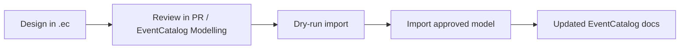

This guide shows the end-to-end path from `.ec` design work to published EventCatalog docs.



## Step 1: Create your design model

Start with a new or existing model file:

```bash
touch ./architecture/main.ec
```

Model your domains, services, messages, channels, and notes in `main.ec`.

## Step 2: Share and review the design

Use Git PRs for architecture review and optionally share a visual link via EventCatalog Modelling:

- https://playground.eventcatalog.dev/new

## Step 3: Preview documentation impact

Before writing docs, run import in dry-run mode:

```bash
npx @eventcatalog/cli --dir ./catalog import ./architecture/main.ec --dry-run
```

This shows what will be created, updated, or versioned.

## Step 4: Import the approved design

When the design is approved:

```bash
npx @eventcatalog/cli --dir ./catalog import ./architecture/main.ec
```

This writes the modeled resources into your EventCatalog.

## Step 5: Publish and iterate

Build and preview docs as part of your normal docs pipeline:

```bash
pnpm --dir ./catalog build
```

Repeat this loop whenever the target architecture changes.
