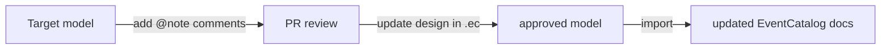

When architects and engineers review future-state designs, feedback often gets lost across chat threads and docs. Use `@note` annotations in `.ec` models so review comments live next to the architecture change itself.

In the DSL, this is written as `@note` (singular). You can add multiple notes to the same resource.



## What to capture in notes

- Open questions (`Should this be async or sync?`)
- Risks (`Ordering guarantees still unclear`)
- Team ownership decisions
- Follow-up tasks needed before implementation

## Example: Notes on a service and message

```ec title="main.ec"
service CheckoutService {
  version 2.0.0
  summary "Coordinates checkout flow"
  owner checkout-team

  @note("Should this service own payment retries or delegate to PaymentsService?")
  @note("Need SRE review for timeout and retry policy", author: "platform-team", priority: "high")

  sends event CheckoutSubmitted@2.0.0 to CheckoutChannel@1.0.0
}

event CheckoutSubmitted {
  version 2.0.0
  @note("Confirm payload includes fraud score before release", author: "risk-team")
}
```

## Review workflow

1. Export current docs to `.ec` and create a target model branch.
2. Add `@note` annotations where decisions are still open.
3. Share the `.ec` diff in a pull request.
4. Resolve notes by updating the model.
5. Import the approved model into EventCatalog.

## Optional: use EventCatalog Modelling for live feedback

You can paste your model into EventCatalog Modelling, share the link in your PR, and discuss the design with visual context:

- https://playground.eventcatalog.dev/
