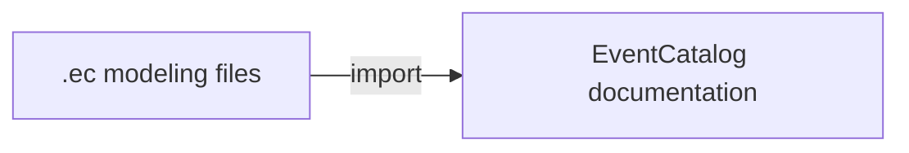

Importing means taking one or more `.ec` modeling files and converting them into real EventCatalog resources (services, events, domains, and more). You run this when you want your modeled architecture to become browsable, durable documentation in your catalog.
You can use this to create a new catalog or update an existing catalog.



## Command

```bash
npx @eventcatalog/cli --dir ./catalog import [files...] [--stdin] [--dry-run] [--flat] [--no-init]
```

### Example

Import a single model file into your catalog directory:

```bash
npx @eventcatalog/cli --dir ./catalog import ./main.ec
```

## Inputs

- One file: `import ./catalog.ec`
- Multiple files: `import ./core.ec ./payments.ec`
- Stdin: `import --stdin`

## What import does

- Parses `.ec` definitions.
- Creates or updates matching EventCatalog resources.
- Handles version-aware writes.
- Adds missing message/channel stubs when references exist without inline definitions.

## Useful flags

- `--dry-run`: Preview creates/updates/versioning without writing files.
- `--flat`: Write resources in top-level folders instead of nested structures.
- `--no-init`: Skip initialization prompts in automation.

## Supported imported resource types

- `event`, `command`, `query`, `service`, `domain`, `channel`
- `container`, `data-product`, `diagram`
- `user`, `team`

## Notes on versioning

When importing a newer version for an existing resource, import can version prior content and report the versioned resource in the output summary.
